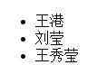

# 数组拓展方法1

## 1、forEach 遍历
- 用法：

```javascript
// 只有数组可以用
arr.forEach(function(ele,index,self){   //这个回调会执行多少次取决于arr里有多少项，这里只是声明，不是调用
    console.log(ele, index, self);  //ele-执行函数的那一项的值， index-执行函数的那一项的索引，self-arr数组本身
  })

  arr.forEach(function(ele,index,self){    //如果要用第二个参数改变this指向，就不能用箭头函数，箭头函数里this指向定义它的window
      console.log(ele, index, self，this);  
    },{name:'eva'})   //第二个参数决定函数每次执行的时候，this指向是谁，如果不传的化，this指向window
//第一个参数(回调函数)是必填的，第二个参数选填；
```
- 例子：

```html
<!DOCTYPE html>
<html lang="en">
<head>
  <meta charset="UTF-8">
  <meta name="viewport" content="width=device-width, initial-scale=1.0">
  <meta http-equiv="X-UA-Compatible" content="ie=edge">
  <title>Document</title>
</head>
<body>
<ul>
  <li></li>
  <li></li>
  <li></li>
</ul>
</body>
<script type="text/javascript">
  let personArr = [
    {name: '王港',  age: 18},
    {name: '刘莹', age: 23} ,
    {name: '王秀莹',  age: 25}
  ];

  personArr.forEach(function(ele,index,self){
    this[index].innerText = ele.name;
  },document.getElementsByTagName('li'))  //document.getElementsByTagName('li')获取的是类数组，this就是这个类数组
</script>
</html>
```


- 原理猜想：


    思路：
    我们还原函数，首先要知道函数的调用形式时什么样的
    1、有个func作为形参（回调）  
    2、回调函数执行多少次取决于arr的长度length
    3、函数执行时this指向 取决于第二个参数arguments[1 ]

```javascript
Array.prototype.myForEach = function(func){    //把方法写在数组构造函数Array的原型prototype上，那后每个数组都是Array的实例，都可以继承其原型上的方法。
  let _arr = this,   //这里是：哪个数组调用这个方法，this就是那个数组
      len = _arr.length,
      param2 = arguments[1] || window;  //augumengts是函数的实参列表，如果有传第二个 参数，就是第二个参数的值，没有传第二个参数的话就是window

  for(let i = 0;i < len;i++){    //通过for循环控制回调func执行多少次，且执行次数和数组长度len有关
    // func.apply(param2);  //通过apply改变func执行时的this指向，this指向和有没有传第二个参数有关，或者用func.call(param2)也可以
    // func.apply(this指向的对象，[实参1，实参2，实参3...])
    func.apply(param2,[_arr[i] , i , _arr]); //func执行时this的指向param2,第二个参数时func的实参[执行当前次数的元素，当前次数的元素索引，数组本身]
  }
}

// 使用
personArr.myForEach(function(ele,index,self){
  this[index].innerText = ele.name;
},document.getElementsByTagName('li'))
```

## 2、filter 遍历后过滤
- 用法

```javascript
// 条件的筛选，数据的过滤
let newArr = personArr.filter(function(ele,index,self){  
  //自己写逻辑进行筛选，要求回调函数执行完必须有个布尔类型返回值，返回值觉得当前项会不会被留下来返回到新数组中
  if(ele.sex == 'm'){
    return true;
  }else{
    return false;
  }
},{name:'eva'})
```
上方的简化写法

```javascript
let newArr = personArr.filter(function(ele,index,self){  
  return ele.sex == 'm'   //简化写法
},{name:'eva'})
```

- 实现猜想

```javascript
Array.prototype.myFilter = function(func){
  let _arr = this,
     len = _arr.length,
     param2 = arguments[1]  || window,
     newArr = [];   //最后返回一个新数组

     for(let i = 0; i < len; i++){
       // func.apply(param2,[_arr[i] , i ,_arr]) 函数执行的时候，给传3个实参
       func.apply(param2,[_arr[i] , i ,_arr]) ? newArr.push(_arr[i]) : '' ;  //看函数执行后的返回结果，返回true就往返回的数组里放当前先，否则什么都不做
     }
     return newArr;
}
```

## 3、map 遍历后映射
x 通过一定的规则 变成 y , map完后返回一个新数组
把数组里的每一项都按定义的规则处理下，每个元素对应产出一个新结果。
- 用法：

```javascript
let newARR = personArr.map(function(ele,index,self){
  return ele.name ;  //返回一个处理规则
},{name:'eva'})
```
注意： map 和 filter 返回的新数组中的数组项如果时引用值，我们操作新数组 是会对原数组有影响的，因为返回的时候引用值是 浅拷贝 ；


```javascript
let newARR = personArr.map(function(ele,index,self){
  ele.age = ele.age + 10;
  return ele ;  //返回一个处理规则
},{name:'eva'})
newArr.age = 111;  //返回处理的newArr，再看personArr也被修改了
```
- 实现猜想

```javascript
Array.prototype.myMap = function(func){
  let _arr = this,  //保存当前的this
      len = _arr.length,
      param2 = arguments[1] || window,
      newARR =[];
  for(let i = 0;i < len; i++){
    newArr.push(func.apply(param2,[_arr[i] ,i ,_arr]));   //把函数的返回值放当新数组中，如果深克隆的化，在这里处理下要push的内容
  }
  return newArr;
}
```
## 4、every 和 some
- 用法：

every - 是否都满足规则，都满足返回true,有一个不满足，当时就跳出循环，返回false,类似逻辑与&&
```javascript
var result = personArr.every(function(ele,index,self){
  return ele.age >15 ;  //就像逻辑与&&，每一项都返回true,every才返回true，全部循环一遍；遇到false就直接返回false,不再遍历了
},{name:'eva'})
```
some - 有一次为true就返回true,当时就跳出循环了，全部都为false才返回false
```javascript
var result = personArr.some(function(ele,index,self){
  return ele.age >15 ;  //有一次为true就返回true,当时就跳出循环了，全部都为false才返回false
},{name:'eva'})
```
- 原理猜想

every :
```javascript
Array.prototype.myEvery = function(func){
  var _arr = this,
      len = _arr.length,
      param2 = arguments[1] || window,
      result = true;
  for(let i = 0; i < len; i++){
    if(!func.apply(param2,[_arr[i], i, _arr])){  //如果回调函数规则判断当前项为false的话，result为false,break跳出循环，并返回false
      result = false;
      break;
    }  //如果循环结束都为true,就没有进入if,直接返回true
  }
  return result;
}
```
some :
```javascript
Array.prototype.mySome = function(func){
  var _arr = this,
      len = _arr.length,
      param2 = arguments[1] || window,
      result = false;
  for(let i = 0; i < len; i++){
    if(func.apply(param2,[_arr[i], i, _arr])){  //如果回调函数规则判断当前项为ture的话，result为true,break跳出循环，并返回true
      result = true;
      break;
    }  //如果循环结束都为false,就没有进入if,直接返回false
  }
  return result;
}
```

## 5、reduce
1. reduce执行完会返回一个值  
2. 第一个参数是回调函数，此函数有4个参数：prevValue \ curVlue \ index \ self （上一个值，当前值，索引，数组本身），curVlue 可以认为是ele  
3. 第二个参数是必填的initialValue - 初始化值（决定回调函数执行第一次的时候，第一个prevValue的值 )
4. 第一个回调函数的返回值是下一次回调函数中的prevValue
- 用法：

```javascript
  let initialValue = {name:'eva'};
  let lastValue = personArr.reduce(function(prev,cur,index,self){
      // return  prev;   返回prev 就是每次的prev都一样
    prev.name += 1
    return  prev;   //这个返回值是下一次回调函数执行时的prevValue
  },initialValue)  //initialValue 是第一次回调的时候的prevValue
```

- 原理猜想 ：

```javascript
Array.prototype.myReduce = function(func,initialValue){  //必填的2个参数
  let _arr = this,
      len = _arr.length;

  for(let i = 0;i < len;i++){
    initialValue = func(initialValue, _arr[i],  i, _arr);   //回调的返回值是下一次回调函数执行时的prevValue  
  }
  return initialValue ;  //reduce返回值，是最后一次回调函数执行的返回结果
}
```
- 例子：

```javascript
// 把如下字符串变成对象，键值对模式
  let cookieStr = "uuid_tt_dd=10_20960239260-1579182902777-403419; dc_session_id=10_1579182902777.890617; TY_SESSION_ID=f43a559f-a2e3-4f3e-832e-b17aa31e5e39;   __gads=ID=dca71a9317d73238:T=1579928694:S=ALNI_MZSGdK3nTarxaoNCaeU2D33bvqKhA; firstDie=1; "
  // 例如上面是一段cookie，正常我们用document.cookie 获得
  function parseCookie(str){  //
    let arr = str.split(';');
    let cookieObj = {};   //定义一个对象，操作 并 最后返回这个对象
    arr.reduce(function(prev,cur,index,self){
      let curArr = cur.split('=');
      cookieObj[ curArr[0] ] = curArr[1];
      return prev;   //所有的回调都是返回 cookieObj
    },cookieObj)
    return cookieObj;
  }
let cookieObj = parseCookie(cookieStr)
console.log(cookieObj.uuid_tt_dd);
```
